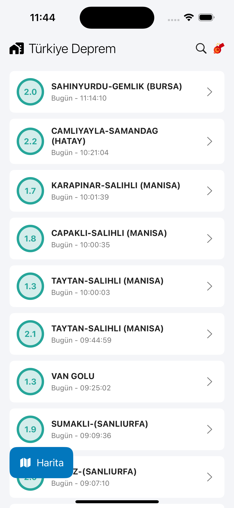
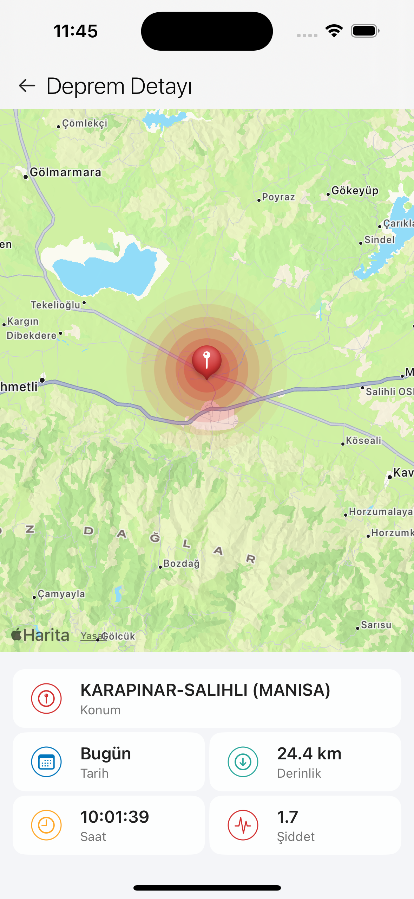
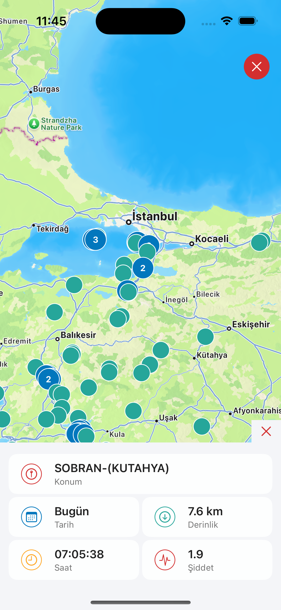

# Türkiye Deprem

Türkiye Deprem is an iOS application developed to track earthquakes in Turkey. The app allows users to view earthquake details, see earthquake locations on a map, and access other related information.

## Features

- View earthquake details
- Display earthquake locations on a map
- Color coding based on earthquake magnitude
- Update earthquake data

## Installation

1. Clone this repository:
    ```sh
    git clone https://github.com/ahmet-ozberk/Turkiye-Deprem-Ios.git
    ```
2. Navigate to the project directory:
    ```sh
    cd Turkiye-Deprem-Ios
    ```
3. Open the project with Xcode:
    ```sh
    open Turkiye Deprem.xcodeproj
    ```
4. Resolve Swift Package Manager dependencies:
    ```sh
    xcodebuild -resolvePackageDependencies
    ```

## Contributing

If you would like to contribute, please submit a pull request or open an issue.

## Android Version

The Android version of this project is developed using Jetpack Compose and is available on the Google Play Store. You can download it from the following link:
[Turkey Earthquake on Google Play Store](https://play.google.com/store/apps/details?id=com.tosbik.turkiyedeprem)

## Screenshots

<p float="left">
  
  
  
</p>